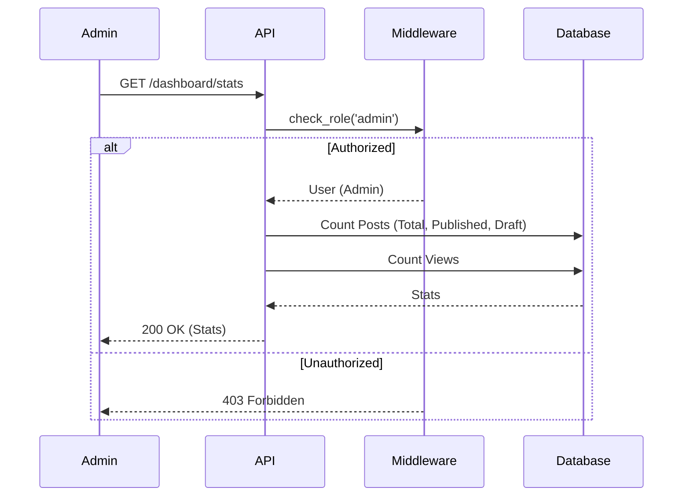

# Analytics & Dashboard API

## Dashboard Stats
`GET /api/v1/dashboard/stats`

Retrieves summary statistics for the admin dashboard.

**Response:**
```json
{
  "total_articles": 142,
  "published_articles": 128,
  "draft_articles": 14,
  "total_views": 45000,
  "views_trend": "+12%"
}
```

## Admin Post List
`GET /api/v1/dashboard/posts`

Retrieves a table view of posts for the admin console with extended details.

**Query Parameters:**
- `status`: (str) Filter by status (draft, published, etc.)
- `category`: (str) Filter by category
- `sort`: (str) Sort field
- `skip`: (int)
- `limit`: (int)

**Response:**
```json
{
  "total": 142,
  "items": [
    {
      "id": 1,
      "title": "The Hallucination is the Feature",
      "slug": "...",
      "status": "published",
      "category": { "name": "AI & Ethics" },
      "views": 1200,
      "author": { "full_name": "Jonathan Doe" },
      "created_at": "2026-02-18T10:00:00Z",
      "updated_at": "2026-02-18T10:00:00Z"
    }
  ]
}
```

## Sequence Diagrams

### Dashboard Stats


