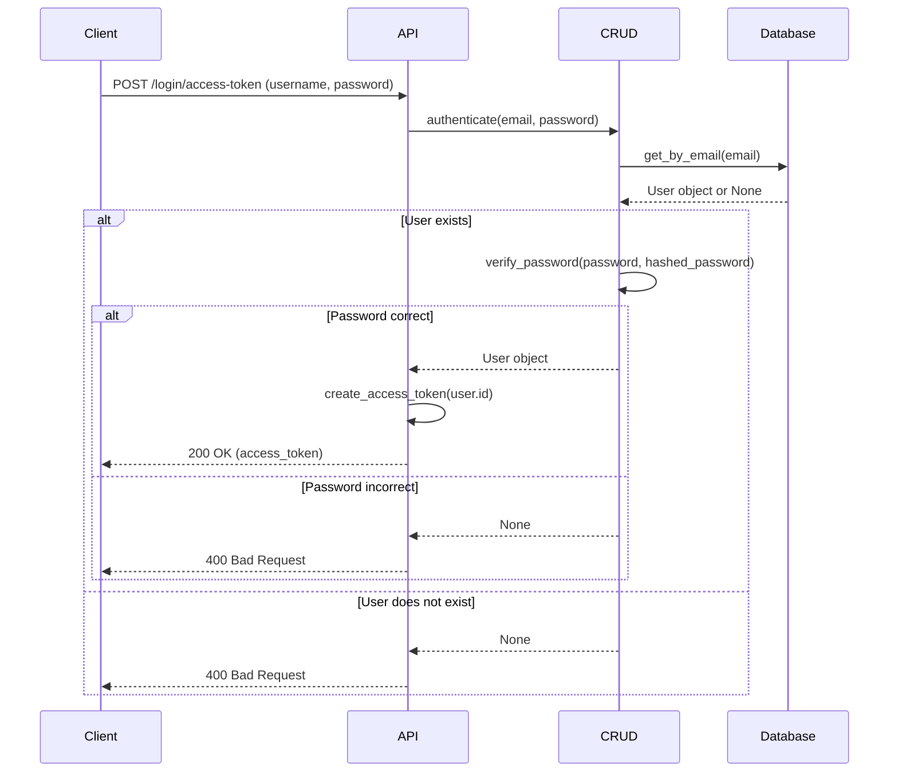

# Auth API

## Login Access Token

**Method**: `POST`
**URL**: `/api/v1/login/access-token`

**Description**:
OAuth2 compatible token login, get an access token for future requests.

**Request Body** (`application/x-www-form-urlencoded`):

| Field | Type | Description | Required |
| :--- | :--- | :--- | :--- |
| `username` | string | User's email | Yes |
| `password` | string | User's password | Yes |

**Response Codes**:

- `200 OK`: Successful login.
- `400 Bad Request`: Incorrect email or password, or inactive user.

**Response Body** (JSON):

```json
{
  "access_token": "string",
  "token_type": "bearer"
}
```

## Sequence Diagram


