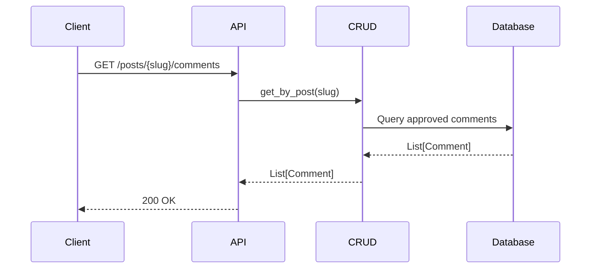
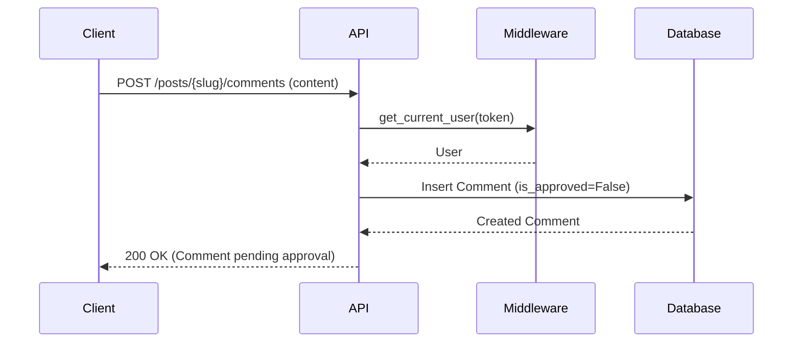

# Comments API

## List Comments
`GET /api/v1/posts/{post_slug}/comments`

Retrieves approved comments for a specific post.

**Query Parameters:**
- `skip`: (int) Offset
- `limit`: (int) Limit

**Response:**
```json
{
  "total": 5,
  "items": [
    {
      "id": 101,
      "content": "Great article!",
      "user": { "id": 50, "full_name": "Alice User", "avatar_url": "..." },
      "created_at": "2026-02-18T12:00:00Z"
    }
  ]
}
```

## Create Comment
`POST /api/v1/posts/{post_slug}/comments`

Adds a comment to a post. Requires authentication.

**Body:**
```json
{
  "content": "My thoughts on this..."
}
```

## Approve Comment (Admin)
`POST /api/v1/comments/{id}/approve`

Approves a comment for display.

**Response:**
```json
{ "id": 101, "is_approved": true }
```

## Delete Comment (Admin/Owner)
`DELETE /api/v1/comments/{id}`

Deletes a comment.

## Sequence Diagrams

### List Comments



### Add Comment


