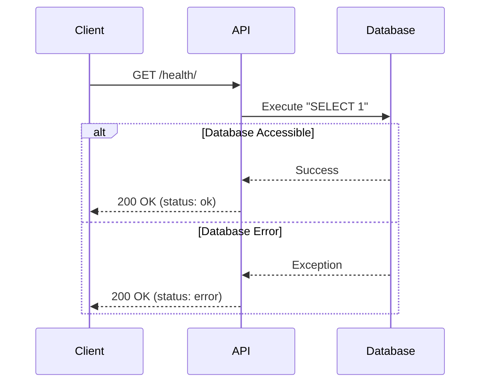

# Health API

## Health Check

**Method**: `GET`
**URL**: `/api/v1/health/`

**Description**:
Check if the service is up and the database is accessible.

**Response Codes**:

- `200 OK`: Service is healthy.

**Response Body** (JSON):

```json
{
  "status": "ok"
}
```

If the health check fails, it might return:

```json
{
  "status": "error"
}
```

## Sequence Diagram


