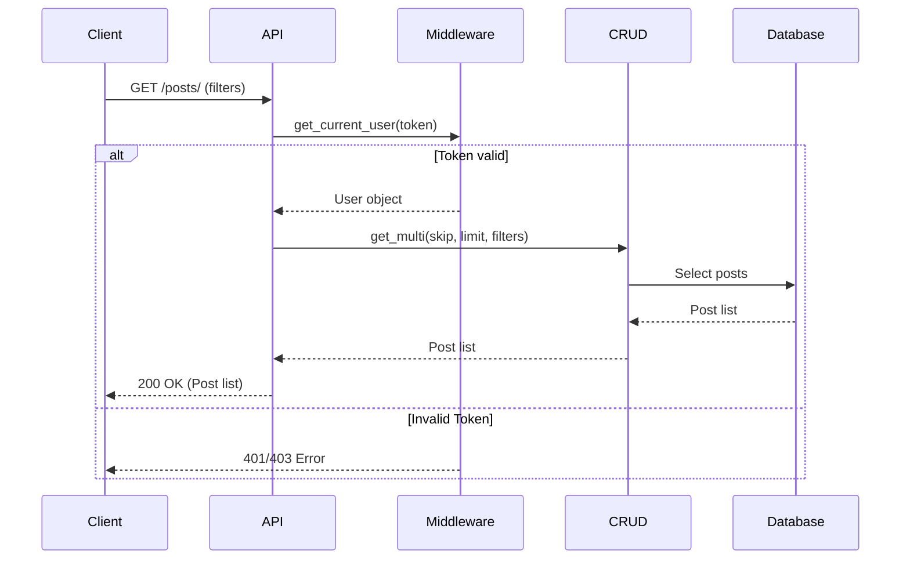
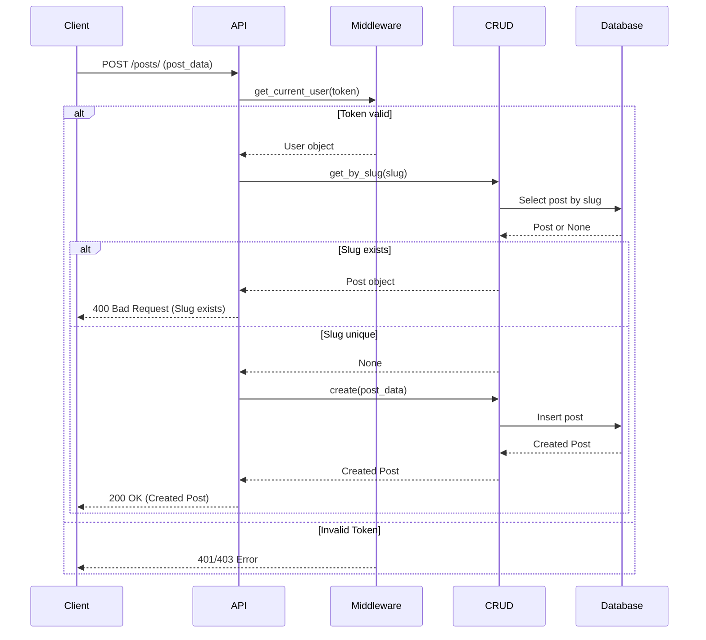
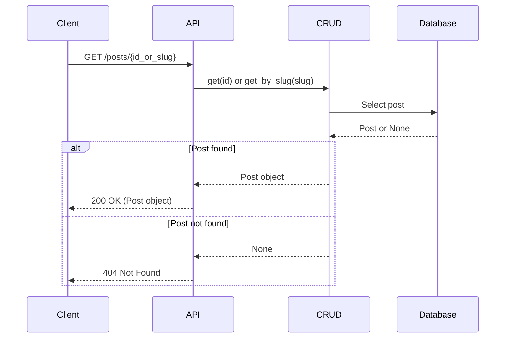
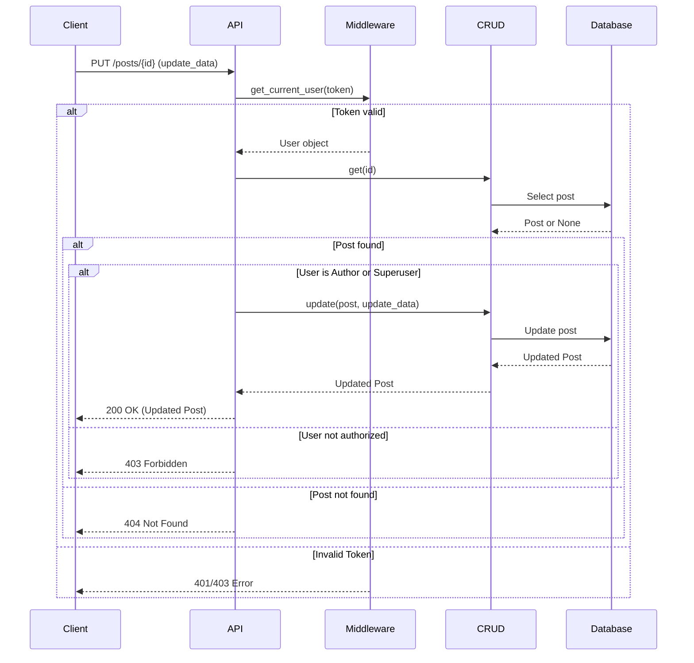
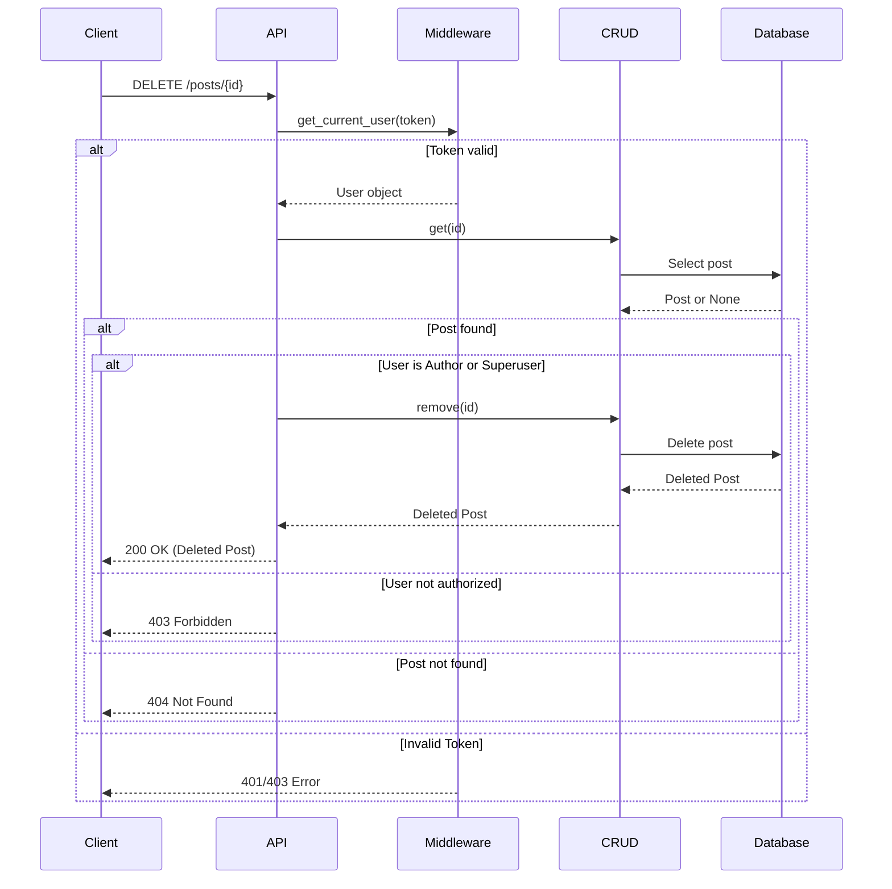
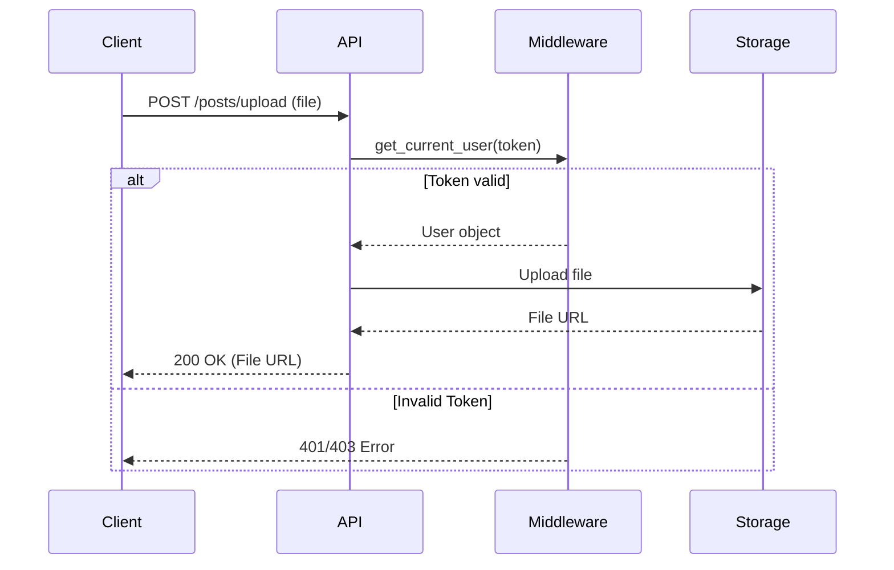

# Posts API

## List Posts

**Method**: `GET`
**URL**: `/api/v1/posts/`

**Description**:
Retrieve posts. Can be filtered by status, category, or tags.

**Request Parameters**:

| Parameter | Type | Description | Default | Required |
| :--- | :--- | :--- | :--- | :--- |
| `skip` | integer | Number of records to skip | 0 | No |
| `limit` | integer | Max number of records to return | 100 | No |
| `status` | string | Filter by status ('draft', 'published') | None | No |
| `category_id` | integer | Filter by category ID | None | No |
| `tag_id` | integer | Filter by tag ID | None | No |
| `search` | string | Search term for title | None | No |

**Authentication**:
Requires a valid access token.

**Response Body** (JSON Array):

```json
[
  {
    "id": 1,
    "title": "Judul Postingan...",
    "slug": "judul-postingan",
    "status": "published",
    "visibility": "public",
    "created_at": "2023-10-27T10:00:00Z",
    "updated_at": "2023-10-27T12:00:00Z",
    "author": {
      "id": 1,
      "full_name": "Admin User"
    },
    "category": {
      "id": 1,
      "name": "Hardware",
      "slug": "hardware"
    },
    "tags": [
      {
        "id": 1,
        "name": "Tech",
        "slug": "tech"
      }
    ]
  }
]
```

### Sequence Diagram



---

## Create Post

**Method**: `POST`
**URL**: `/api/v1/posts/`

**Description**:
Create a new post.

**Request Body** (JSON):

```json
{
  "title": "Judul Postingan...",
  "slug": "slug-postingan-otomatis",
  "content": "<p>Mulai menulis cerita Anda di sini...</p>",
  "status": "draft",
  "visibility": "public",
  "scheduled_at": "2023-11-01T09:00:00Z",
  "category_id": 1,
  "tag_ids": [1, 2],
  "thumbnail_url": "https://storage.googleapis.com/...",
  "meta_title": "Judul Postingan for SEO",
  "meta_description": "Deskripsi singkat...",
  "canonical_url": "https://...",
  "pdf_url": "https://storage.googleapis.com/..."
}
```

**Authentication**:
Requires a valid access token.

**Response Codes**:

- `200 OK`: Post created successfully.
- `400 Bad Request`: Slug already exists.

### Sequence Diagram



---

## Get Post

**Method**: `GET`
**URL**: `/api/v1/posts/{id_or_slug}`

**Description**:
Get a single post details by ID or Slug.

**Response Body** (JSON):

```json
{
  "id": 1,
  "title": "Judul Postingan...",
  "slug": "judul-postingan-otomatis",
  "content": "<p>Content...</p>",
  "status": "draft",
  "visibility": "public",
  "scheduled_at": null,
  "thumbnail_url": null,
  "meta_title": "Judul",
  "meta_description": "Desc",
  "canonical_url": null,
  "pdf_url": null,
  "created_at": "2023-10-27T10:00:00Z",
  "updated_at": "2023-10-27T10:00:00Z",
  "author_id": 1,
  "category": {
      "id": 1,
      "name": "Hardware",
      "slug": "hardware"
  },
  "tags": [
      {
          "id": 1,
          "name": "Tech",
          "slug": "tech"
      }
  ]
}
```

### Sequence Diagram



---

## Update Post

**Method**: `PUT`
**URL**: `/api/v1/posts/{id}`

**Description**:
Update an existing post.

**Request Body** (JSON): SAME AS CREATE POST, but all fields optional.

**Authentication**:
Requires a valid access token. Author or Superuser only.

### Sequence Diagram



---

## Delete Post

**Method**: `DELETE`
**URL**: `/api/v1/posts/{id}`

**Description**:
Delete a post.

**Authentication**:
Requires a valid access token. Author or Superuser only.

### Sequence Diagram



---

## Upload Media

**Method**: `POST`
**URL**: `/api/v1/posts/upload`

**Description**:
Upload a file (Image for thumbnail or PDF) to storage. Returns the public URL.

**Request Body** (Multipart/Form-Data):
- `file`: File binary.

**Response Body** (JSON):

```json
{
  "url": "https://storage.googleapis.com/bucket/filename.ext",
  "filename": "filename.ext",
  "content_type": "image/jpeg"
}
```

### Sequence Diagram


