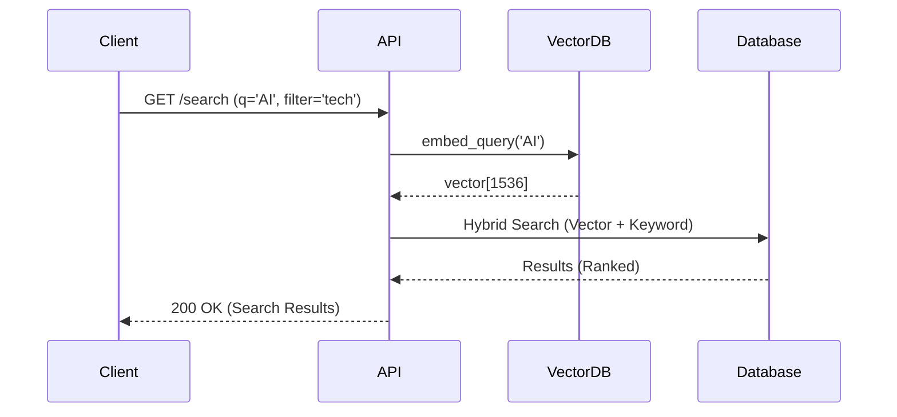

# Search API

## Global Search
`GET /api/v1/search`

Performs a hybrid search (Semantic + Keyword) across posts.

**Query Parameters:**
- `q`: (str) Search query (required).
- `filter`: (str) Category slug (e.g., "essays", "news"). Default: "all".
- `sort`: (str) Sort order:
    - `relevance` (default, uses vector similarity)
    - `date` (newest first)
- `skip`: (int) Offset.
- `limit`: (int) Limit.

**Response:**
```json
{
  "total": 12,
  "items": [
    {
      "id": 1,
      "title": "Generative AI: The Hallucination is the Feature",
      "slug": "generative-ai-hallucination",
      "excerpt": "Mengapa mengejar akurasi sempurna...",
      "highlight": "Mengapa mengejar akurasi sempurna dalam LLM...",
      "category": { "name": "AI & Ethics", "slug": "ai-ethics" },
      "author": { "full_name": "Jonathan Doe" },
      "published_at": "2026-02-18T10:00:00Z",
      "relevance_score": 0.95
    }
  ]
}
```

## Sequence Diagrams

### Global Search


