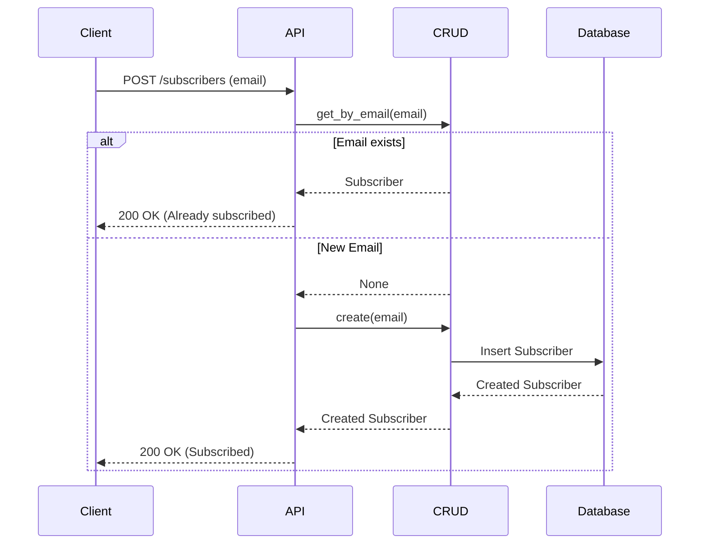

# Newsletter Subscribers API

## Subscribe
`POST /api/v1/subscribers`

Subscribes an email to the newsletter.

**Body:**
```json
{
  "email": "user@example.com"
}
```

**Response:**
```json
{ "message": "Successfully subscribed." }
```

## Unsubscribe
`DELETE /api/v1/subscribers/{email}`

Unsubscribes an email.

## Sequence Diagrams

### Subscribe


