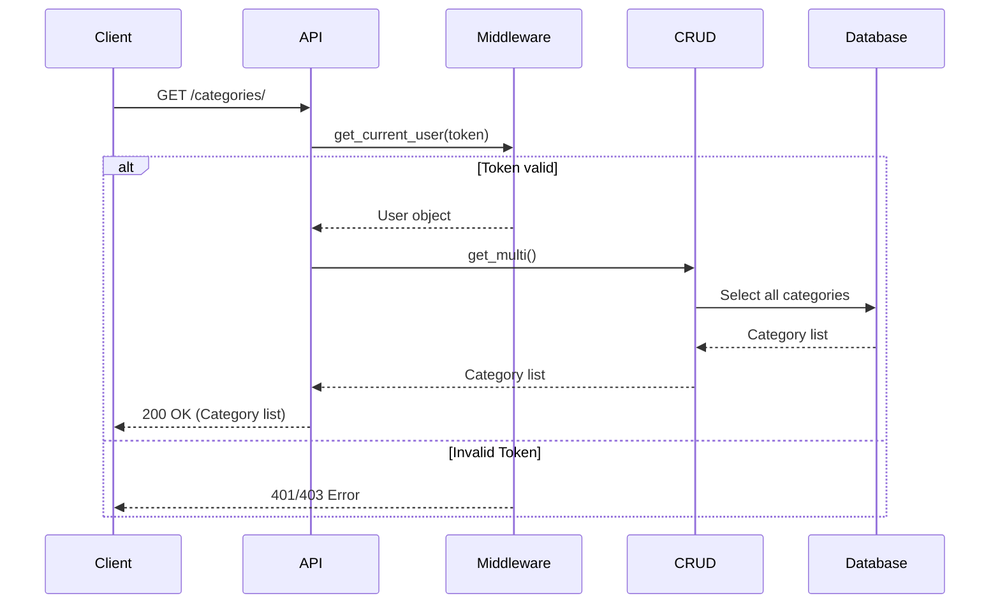
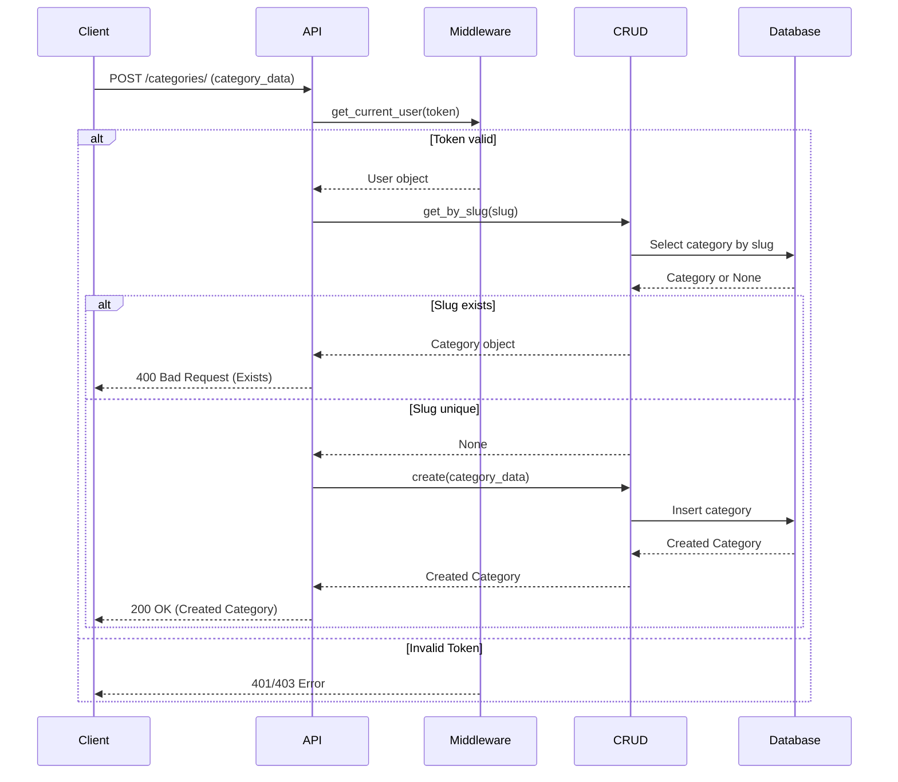
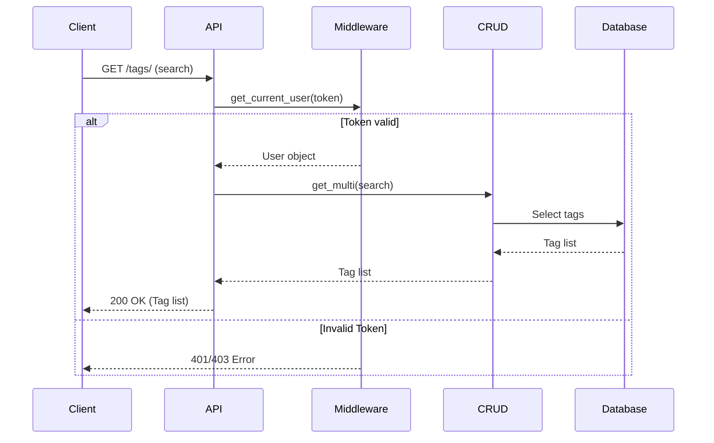
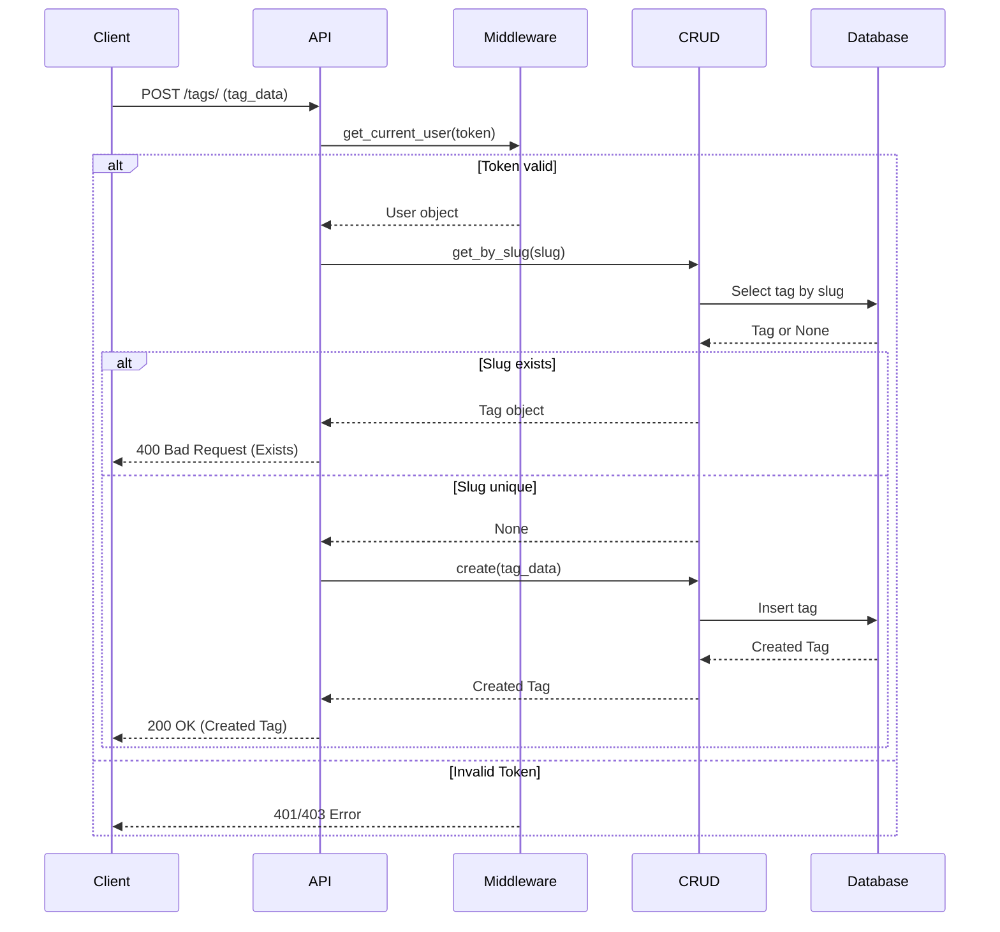

# Taxonomy API

## Categories

### List Categories

**Method**: `GET`
**URL**: `/api/v1/categories/`

**Description**:
Retrieve all categories.

**Authentication**:
Requires a valid access token.

**Response Body** (JSON Array):

```json
[
  {
    "id": 1,
    "name": "Hardware",
    "slug": "hardware"
  },
  {
    "id": 2,
    "name": "Software",
    "slug": "software"
  }
]
```

#### Sequence Diagram



### Create Category

**Method**: `POST`
**URL**: `/api/v1/categories/`

**Description**:
Create a new category.

**Request Body** (JSON):

```json
{
  "name": "New Category"
}
```

**Response Body** (JSON):

```json
{
  "id": 3,
  "name": "New Category",
  "slug": "new-category"
}
```

#### Sequence Diagram



---

## Tags

### List Tags

**Method**: `GET`
**URL**: `/api/v1/tags/`

**Description**:
Retrieve all tags. Can be searched.

**Request Parameters**:

| Parameter | Type | Description | Default | Required |
| :--- | :--- | :--- | :--- | :--- |
| `search` | string | Search term for tag name | None | No |

**Authentication**:
Requires a valid access token.

**Response Body** (JSON Array):

```json
[
  {
    "id": 1,
    "name": "Tech",
    "slug": "tech"
  },
  {
    "id": 2,
    "name": "Philosophy",
    "slug": "philosophy"
  }
]
```

#### Sequence Diagram



### Create Tag

**Method**: `POST`
**URL**: `/api/v1/tags/`

**Description**:
Create a new tag.

**Request Body** (JSON):

```json
{
  "name": "New Tag"
}
```

**Response Body** (JSON):

```json
{
  "id": 3,
  "name": "New Tag",
  "slug": "new-tag"
}
```

#### Sequence Diagram


