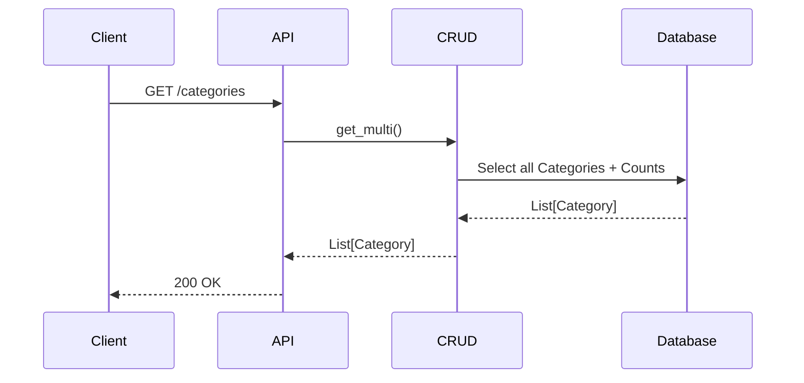
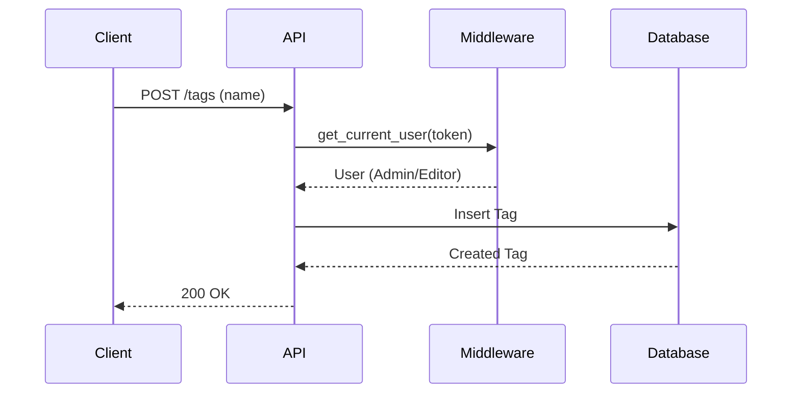

# Taxonomy API

## List Categories
`GET /api/v1/categories`

Retrieves all categories. Used for dropdowns and filtering.

**Response:**
```json
[
  { "id": 1, "name": "Architecture", "slug": "architecture", "count": 10 },
  { "id": 2, "name": "AI & Ethics", "slug": "ai-ethics", "count": 5 },
  { "id": 3, "name": "Hardware", "slug": "hardware", "count": 20 },
  { "id": 4, "name": "Culture", "slug": "culture", "count": 8 }
]
```

## Create Category
`POST /api/v1/categories`

Creates a new category.

**Body:**
```json
{ "name": "New Category", "slug": "new-category" }
```

## List Tags
`GET /api/v1/tags`

Retrieves tags, optionally filtered by search query for autocomplete.

**Query Parameters:**
- `q`: (str) Search term (e.g. "tech")

**Response:**
```json
[
  { "id": 1, "name": "Tech", "slug": "tech" },
  { "id": 5, "name": "Technology", "slug": "technology" }
]
```

## Create Tag
`POST /api/v1/tags`

Creates a new tag.

**Body:**
```json
{ "name": "New Tag", "slug": "new-tag" }
```

## Sequence Diagrams

### List Categories



### Create Tag


