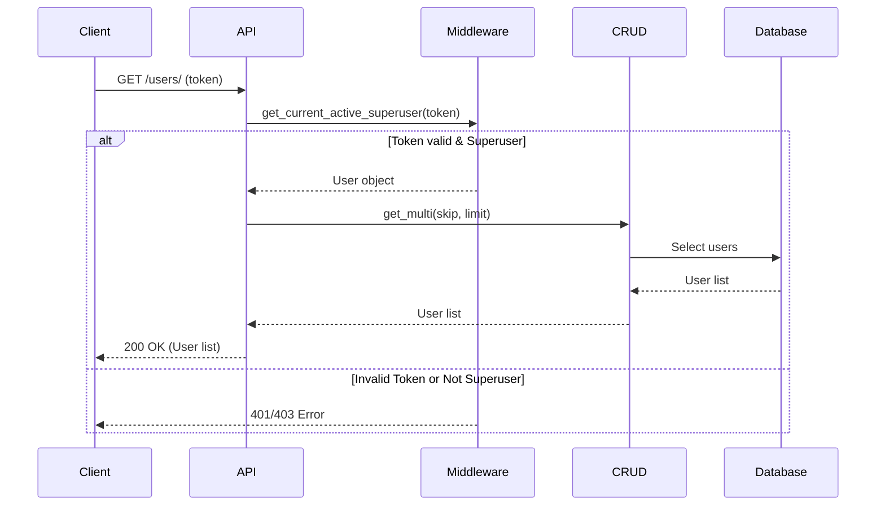
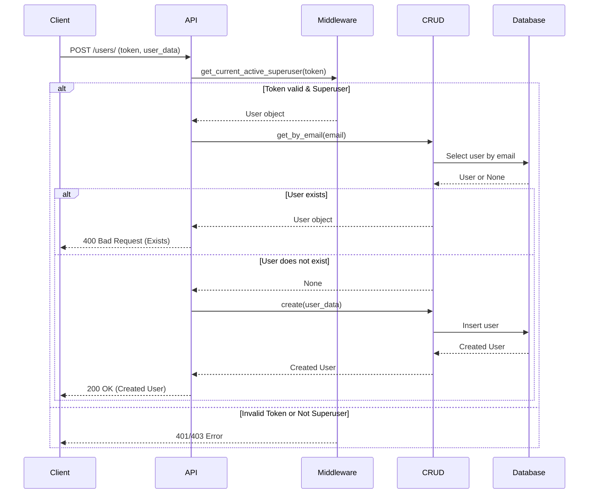
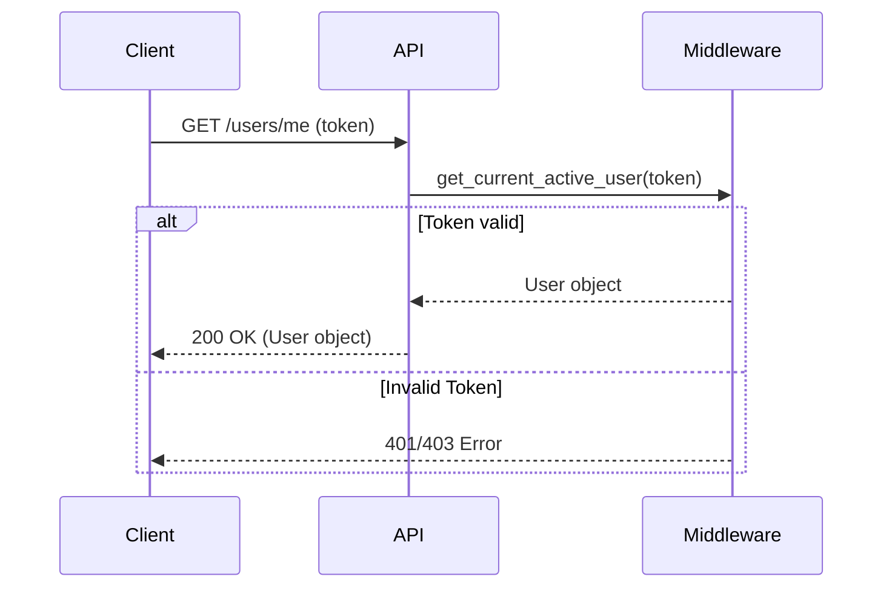

# Users API

## List Users

**Method**: `GET`
**URL**: `/api/v1/users/`

**Description**:
Retrieve users. Only superusers can list all users.

**Request Parameters**:

| Parameter | Type | Description | Default | Required |
| :--- | :--- | :--- | :--- | :--- |
| `skip` | integer | Number of records to skip | 0 | No |
| `limit` | integer | Max number of records to return | 100 | No |

**Authentication**:
Requires a valid access token from a superuser.

**Response Body** (JSON Array):

```json
[
  {
    "email": "user@example.com",
    "is_active": true,
    "is_superuser": false,
    "full_name": "John Doe",
    "role_id": 1,
    "id": 1,
    "role": {
       "id": 1,
       "name": "user",
       "description": "Regular user"
    }
  }
]
```

### Sequence Diagram



---

## Create User

**Method**: `POST`
**URL**: `/api/v1/users/`

**Description**:
Create new user. Only superusers can create new users.

**Request Body** (JSON):

```json
{
  "email": "user@example.com",
  "password": "strongpassword",
  "is_active": true,
  "is_superuser": false,
  "full_name": "John Doe",
  "role_id": 1
}
```

**Authentication**:
Requires a valid access token from a superuser.

**Response Codes**:

- `200 OK`: User created successfully.
- `400 Bad Request`: User with this email already exists.

**Response Body** (JSON):

```json
{
  "email": "user@example.com",
  "is_active": true,
  "is_superuser": false,
  "full_name": "John Doe",
  "role_id": 1,
  "id": 1,
    "role": {
       "id": 1,
       "name": "user",
       "description": "Regular user"
    }
}
```

### Sequence Diagram



---

## Get Current User

**Method**: `GET`
**URL**: `/api/v1/users/me`

**Description**:
Get current user.

**Authentication**:
Requires a valid access token.

**Response Body** (JSON):

```json
{
  "email": "user@example.com",
  "is_active": true,
  "is_superuser": false,
  "full_name": "John Doe",
  "role_id": 1,
  "id": 1,
    "role": {
       "id": 1,
       "name": "user",
       "description": "Regular user"
    }
}
```

### Sequence Diagram


