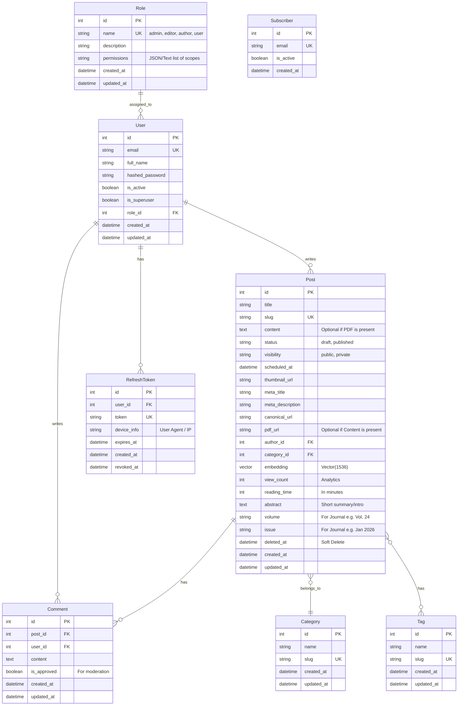

# Entity Relationship Diagram (ERD)

## Auth & CMS Module

The following ERD describes the data model for the application, covering Authentication (RBAC, JWT) and the CMS content module.

## Entity Details

### Role (RBAC)
Defines the access level and permissions for a user.
- **name**: Unique identifier for the role (e.g., 'admin', 'editor').
- **permissions**: List of allowed scopes/actions for this role.

### User
Represents a registered user in the system.
- **role_id**: Links to the `Role` table.
- **is_superuser**: boolean to bypass RBAC checks (God mode).
- **hashed_password**: Bcrypt/Argon2 hash of the password.

### RefreshToken (JWT Security)
Used to obtain new Access Tokens without re-entering credentials.
- **token**: The actual refresh token string (can be hashed).
- **expires_at**: When this token becomes invalid.
- **revoked_at**: Timestamp if the token was manually revoked (logout/security event).
- **device_info**: Optional metadata about where the token was generated.

### Post (Content)
Represents a blog post or article.
- **deleted_at**: **(Soft Delete)** If not null, the post is considered deleted (In Trash).
- **status**: Can be 'draft' or 'published'.
- **visibility**: Can be 'public' or 'private'.
- **author_id**: Links to the `User` who created the post. Ensure only the author (or Admin) can edit/delete this.

### Category & Tag
Taxonomy for organizing content.
- **slug**: URL-friendly identifier.
